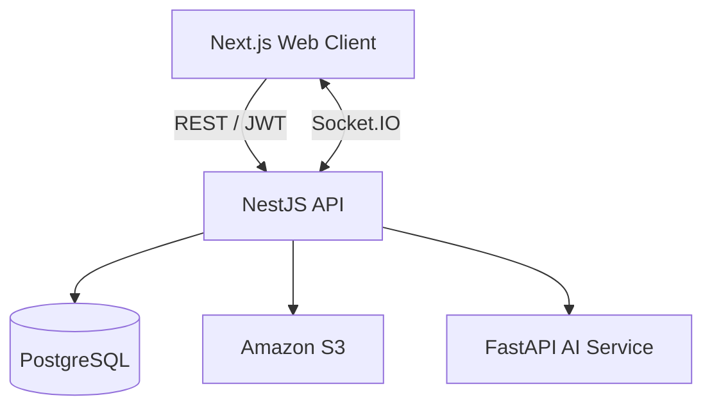

# Let Eat Go API

[English](README.md) | **日本語**

> Let Eat Goの認証、ソーシャルダイニング、チャット、コミュニティ機能を提供するNestJS API

<p align="center">
  
  
  
  
  
  <a href="https://github.com/YJU-5/project-leteatgo-nestjs-repo/actions/workflows/ci.yml"></a>
</p>

## 概要

[Let Eat Go](https://github.com/YJU-5/project-leteatgo-nextjs-repo)は、食事イベントを作成・検索・参加できるソーシャルダイニングプラットフォームです。本リポジトリはそのバックエンドAPIです。

機能単位のModule構成を採用し、JWT認証、Google／Kakaoソーシャルログイン、リアルタイムチャット、コミュニティ投稿、レビュー、通知、画像保存、AI支援による不適切表現チェックを提供します。

## 関連サービス

| サービス | 責務 | リポジトリ |
| --- | --- | --- |
| Web Client | UI、地図、認証フロー、チャット、国際化 | [project-leteatgo-nextjs-repo](https://github.com/YJU-5/project-leteatgo-nextjs-repo) |
| Backend API | REST API、認証、WebSocket、ドメインロジック、DB・S3連携 | **本リポジトリ** |
| AI Service | DistilBERTベースのテキスト分類API | [ai-service](https://github.com/YJU-5/ai-service) |

## 主な責務

- Google／KakaoソーシャルログインとJWTベースの認可
- 食事イベントの作成、検索、参加、参加者管理
- Socket.IO Gatewayによるリアルタイムチャット
- コミュニティ投稿、コメント、いいね、画像アップロード
- レビュー、プロフィール、フォロー、通知
- TypeORMによるPostgreSQL永続化
- Amazon S3への画像アップロード・削除
- 不適切表現分類のためのAI Service連携
- Swagger／OpenAPIドキュメント

## アーキテクチャ



## Module構成

| Module | 責務 |
| --- | --- |
| `auth`, `user` | ソーシャルログイン、JWT検証、ユーザープロフィール |
| `chat-room`, `chat-participant`, `message` | 食事イベントとリアルタイムチャット |
| `board`, `comment`, `like` | アルバム・コミュニティ |
| `review` | イベント後のレビュー |
| `subscription`, `notification` | フォロー関係と通知 |
| `restaurant`, `category`, `tag` | イベント検索用メタデータ |
| `s3` | 画像ストレージ |
| `profanity` | AI Service連携 |

## セットアップ

### 必要環境

- Node.js 20+
- npm 10+
- PostgreSQL 15+
- 任意：画像アップロード用AWS認証情報とS3 Bucket
- 任意：[Let Eat Go AI Service](https://github.com/YJU-5/ai-service)

### インストール

```bash
git clone https://github.com/YJU-5/project-leteatgo-nestjs-repo.git
cd project-leteatgo-nestjs-repo
npm ci
cp .env.example .env
npm run start:dev
```

API： [http://localhost:3001/api](http://localhost:3001/api)  
Swagger： [http://localhost:3001/docs](http://localhost:3001/docs)

公開Liveness Endpointの`GET /api/health`は、JWT認証やDB Queryを必要とせず`{ "status": "ok" }`を返します。

## 環境変数

| 変数 | 必須 | 説明 |
| --- | --- | --- |
| `PORT` | No | HTTP Port。既定値`3001` |
| `CORS_ORIGINS` | No | 許可するFrontend Origin（カンマ区切り） |
| `DB_HOST` | Yes | PostgreSQL Host |
| `DB_PORT` | Yes | PostgreSQL Port |
| `DB_USERNAME` | Yes | PostgreSQL User |
| `DB_PASSWORD` | Yes | PostgreSQL Password |
| `DB_DATABASE_NAME` | Yes | PostgreSQL Database |
| `DB_SYNCHRONIZE` | No | 破棄可能なローカルDBでのみ`true` |
| `JWT_SECRET` | Yes | JWT署名Secret |
| `AWS_REGION` | S3利用時 | AWS Region |
| `AWS_BUCKET_NAME` | S3利用時 | S3 Bucket名 |
| `AWS_ACCESS_KEY_ID` | Local S3のみ | 任意のLocal Credential。ECSではTask Roleを利用可能 |
| `AWS_SECRET_ACCESS_KEY` | Local S3のみ | 任意のLocal Credential。ECSではTask Roleを利用可能 |
| `AI_SERVICE_URL` | No | AI Service URL。既定値`http://localhost:8000` |

## コマンド

| コマンド | 用途 |
| --- | --- |
| `npm run start:dev` | Watch ModeでAPI起動 |
| `npm run build` | TypeScript ApplicationをCompile |
| `npm test` | Unit Test |
| `npm run test:health` | Public Health Endpoint Test |
| `npm run test:e2e` | E2E Test |
| `npm run test:cov` | Coverage Report生成 |
| `npm run lint` | ESLint実行 |

## デプロイ

Multi-stage Node.js 20 Alpine BuildでDocker Imageを作成します。Deployment WorkflowがImageをAmazon ECRへPushし、Amazon ECS上のServiceを更新します。

Deployment CredentialはGitHub Actions SecretsまたはAWS IAM Roleで提供してください。Credentialや生成済みECS Task DefinitionをCommitしないでください。

## Contribution Highlight — @lemonwasp

[@lemonwasp](https://github.com/lemonwasp)は初期Entity設計、認証フロー、Album Backend、Chat RoomのEntity関連、Comment DTO修正、S3画像削除処理に貢献しました。

[Contribution History](https://github.com/YJU-5/project-leteatgo-nestjs-repo/commits/main/?author=lemonwasp)

## ライセンス

教育目的のチームプロジェクトとして作成しました。オープンソースライセンスは宣言していません。
