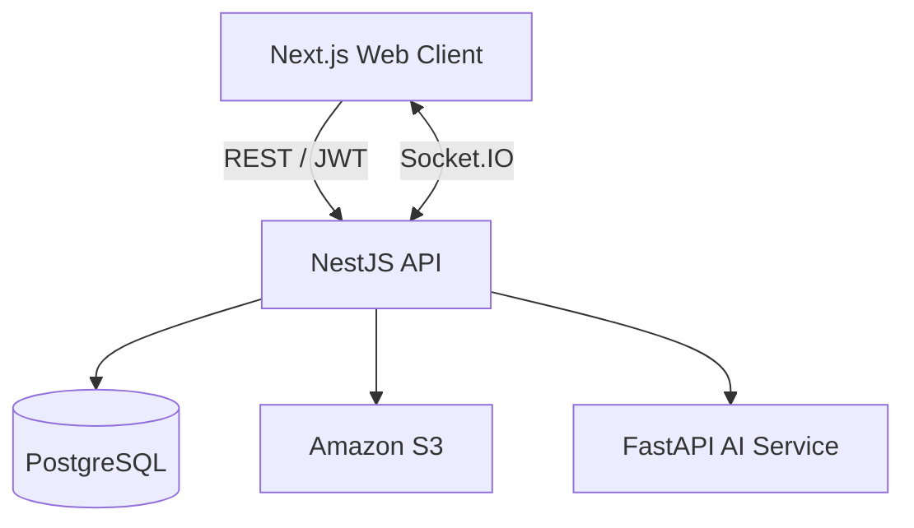

# Let Eat Go API

> Let Eat Goの認証、ソーシャルダイニング、チャット、コミュニティ機能を提供するNestJS API

<p align="center">
  
  
  
  
  
  <a href="https://github.com/YJU-5/project-leteatgo-nestjs-repo/actions/workflows/ci.yml"></a>
</p>

## About

This repository contains the backend API for [Let Eat Go](https://github.com/YJU-5/project-leteatgo-nextjs-repo), a social dining platform that helps people create, discover, and join dining events.

The API is organized into feature modules and provides JWT authentication, Google/Kakao social login, real-time chat, community posts, reviews, notifications, image storage, and an AI-assisted profanity check.

## Related Services

| Service | Responsibility | Repository |
| --- | --- | --- |
| Web Client | UI, maps, authentication flow, chat, internationalization | [project-leteatgo-nextjs-repo](https://github.com/YJU-5/project-leteatgo-nextjs-repo) |
| Backend API | REST API, authentication, WebSocket, domain logic, database and S3 | **This repository** |
| AI Service | DistilBERT-based text classification API | [ai-service](https://github.com/YJU-5/ai-service) |

## Responsibilities

- Google and Kakao social login with JWT-based authorization
- Social dining event creation, discovery, participation, and participant management
- Real-time event chat through a Socket.IO gateway
- Community posts, comments, likes, and image uploads
- Reviews, profiles, subscriptions, and notifications
- PostgreSQL persistence through TypeORM
- Amazon S3 image upload and deletion
- AI service integration for profanity classification
- Swagger/OpenAPI documentation

## Architecture



## Modules

| Module | Responsibility |
| --- | --- |
| `auth`, `user` | Social login, JWT validation, user profiles |
| `chat-room`, `chat-participant`, `message` | Dining events and real-time chat |
| `board`, `comment`, `like` | Album and community interactions |
| `review` | Post-event reviews |
| `subscription`, `notification` | Follow relationships and notifications |
| `restaurant`, `category`, `tag` | Event discovery metadata |
| `s3` | Image storage |
| `profanity` | AI service integration |

## Getting Started

### Prerequisites

- Node.js 20+
- npm 10+
- PostgreSQL 15+
- Optional: AWS credentials and an S3 bucket for image uploads
- Optional: a running [Let Eat Go AI Service](https://github.com/YJU-5/ai-service)

### Installation

```bash
git clone https://github.com/YJU-5/project-leteatgo-nestjs-repo.git
cd project-leteatgo-nestjs-repo
npm ci
cp .env.example .env
npm run start:dev
```

The API starts at [http://localhost:3001/api](http://localhost:3001/api). Swagger documentation is available at [http://localhost:3001/docs](http://localhost:3001/docs).

A public liveness endpoint is available at [`GET /api/health`](http://localhost:3001/api/health). It returns `{ "status": "ok" }` without requiring JWT authentication or a database query.

## Environment Variables

| Variable | Required | Description |
| --- | --- | --- |
| `PORT` | No | HTTP port; defaults to `3001` |
| `CORS_ORIGINS` | No | Comma-separated allowed frontend origins |
| `DB_HOST` | Yes | PostgreSQL host |
| `DB_PORT` | Yes | PostgreSQL port |
| `DB_USERNAME` | Yes | PostgreSQL user |
| `DB_PASSWORD` | Yes | PostgreSQL password |
| `DB_DATABASE_NAME` | Yes | PostgreSQL database |
| `DB_SYNCHRONIZE` | No | Set to `true` only for disposable local databases |
| `JWT_SECRET` | Yes | JWT signing secret |
| `AWS_REGION` | For S3 | AWS region |
| `AWS_BUCKET_NAME` | For S3 | S3 bucket name |
| `AWS_ACCESS_KEY_ID` | Local S3 only | Optional local credential; ECS can use its task role |
| `AWS_SECRET_ACCESS_KEY` | Local S3 only | Optional local credential; ECS can use its task role |
| `AI_SERVICE_URL` | No | AI service URL; defaults to `http://localhost:8000` |

## Commands

| Command | Purpose |
| --- | --- |
| `npm run start:dev` | Start the API in watch mode |
| `npm run build` | Compile the TypeScript application |
| `npm test` | Run unit tests |
| `npm run test:health` | Run the public health endpoint tests |
| `npm run test:e2e` | Run end-to-end tests |
| `npm run test:cov` | Generate a coverage report |
| `npm run lint` | Run ESLint |

## Deployment

The Docker image uses a multi-stage Node.js 20 Alpine build. The deployment workflow builds the image, pushes it to Amazon ECR, and updates the service running on Amazon ECS.

Deployment credentials must be stored in GitHub Actions secrets or provided through an AWS IAM role. Never commit credentials or generated ECS task definitions.

## Contribution Highlight — @lemonwasp

[@lemonwasp](https://github.com/lemonwasp) contributed to the initial entity design, authentication flow, album backend, chat-room relationships, Comment DTO fixes, and S3 image deletion behavior.

See the [contribution history](https://github.com/YJU-5/project-leteatgo-nestjs-repo/commits/main/?author=lemonwasp).

## License

This repository was created as an educational team project. No open-source license has been declared.
